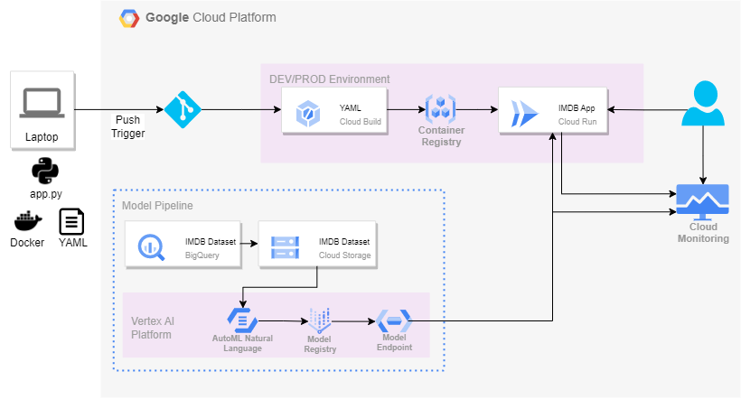

# IMDB Sentiment Analysis App

This application was built for final project requirement for MSDS 434 course.

## Architecture



## Files Overview
* Folder 'app':
    * app.py: Python file with frontend source code built using streamlit
    * Dockerfile: This is the docker file required for deploying frontend-microservice
    * requirements.txt: modules required to run IMDB app
    * predict_text_classification_single_label_sample.py: This python file gets prediction for text classification single label using the predict method
* Cloudbuild_dev.yaml: This file has the steps for google cloud E2E build process. This deploys DEV endpoint.  
* Cloudbuild_prod.yaml: This file has the steps for google cloud E2E build process. This deploys PROD endpoint.

## Deployment Requirements
There are 2 requirements to deploy this repository:
* The model endpoint should already be deployed on vertex ai
    * Change following lines accordingly in app.py \
                    ```
                    prediction=pd.DataFrame(p.predict_text_classification_single_label_sample(
                        project="609731156916",
                        endpoint_id=endpoint,
                        location="us-central1",
                        content=text_input
                    )
                    ```
* Appropriate Google Cloud Build trigger are setup on develop and main branches with correct cloudbuild YAML file linking